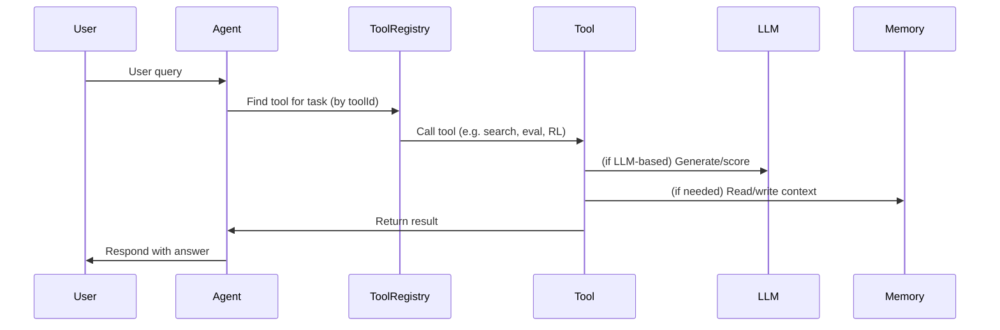
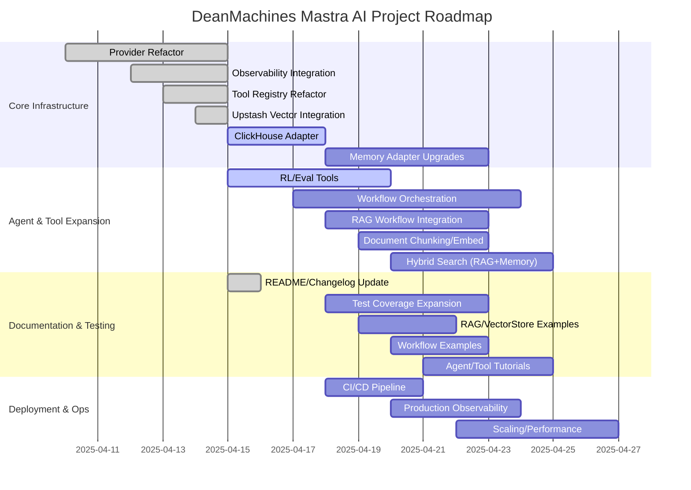

# DeanMachines Mastra AI Workspace

Welcome to the **DeanMachines Mastra AI Workspace**! This monorepo contains the backend, agent, and tool infrastructure for the DeanMachines AI platform, built on the Mastra framework. This README provides a comprehensive overview, technical context, and actionable notes for both human contributors and AI assistants.

---

## Table of Contents

- [DeanMachines Mastra AI Workspace](#deanmachines-mastra-ai-workspace)
  - [Table of Contents](#table-of-contents)
  - [Project Overview](#project-overview)
  - [Workspace Structure](#workspace-structure)
- [Directory Structure](#directory-structure)
  - [Key Concepts](#key-concepts)
  - [Architecture Overview (Mermaid)](#architecture-overview-mermaid)
  - [Agent-Tool-LLM Data Flow (Mermaid)](#agent-tool-llm-data-flow-mermaid)
  - [Agent Types](#agent-types)
  - [Tooling System](#tooling-system)
  - [Memory \& Database](#memory--database)
  - [Observability \& Tracing](#observability--tracing)
  - [Voice \& Speech Integration](#voice--speech-integration)
  - [Model Providers](#model-providers)
  - [Eval \& RL Pipeline](#eval--rl-pipeline)
  - [Vertex AI \& LLM Integration Details](#vertex-ai--llm-integration-details)
  - [Development \& Conventions](#development--conventions)
  - [Changelog](#changelog)
  - [Notes for AI Assistants](#notes-for-ai-assistants)
  - [AI Assistant Notes (For GitHub Copilot / Collaborators)](#ai-assistant-notes-for-github-copilot--collaborators)
  - [Additional AI Assistant Guidance (2025-04-15)](#additional-ai-assistant-guidance-2025-04-15)
  - [Current Progress (as of 2025-04-16)](#current-progress-as-of-2025-04-16)
  - [Project Roadmap (Gantt Diagram)](#project-roadmap-gantt-diagram)
  - [Current Benchmarks (2025-04-15)](#current-benchmarks-2025-04-15)
  - [Final Notes](#final-notes)
  - [Getting Help](#getting-help)

---

## Project Overview

This workspace powers DeanMachines' advanced AI agents, leveraging the [Mastra](https://github.com/agentic-ai/mastra) framework. It is designed for:

- Multi-agent orchestration (research, RL, writing, coding, etc.)
- Reinforcement learning (RL) and feedback-driven optimization
- Tool-augmented LLMs (Google, Vertex AI, OpenAI, etc.)
- Memory persistence and semantic search
- Observability with SigNoz and OpenTelemetry
- Modular, extensible agent and tool design

---

## Workspace Structure

```bash
deanmachines-front/
functions/
├── src/
│   ├── mastra/
│   │   ├── agents/         # Agent configs, implementations, and types
│   │   ├── tools/          # All tool modules (search, evals, RL, etc.)
│   │   ├── database/       # Memory, vector, and cache adapters
│   │   ├── services/       # Integrations (tracing, observability, search, etc.)
│   │   ├── utils/          # Shared utilities (thread manager, diagnostics, etc.)
│   │   ├── voice/          # Voice and speech integrations
│   │   ├── workflows/      # Workflow orchestration and factories
│   │   ├── types.ts        # Shared type definitions
│   │   └── index.ts        # Mastra entrypoint
│   ├── index.ts            # Main entrypoint
│   └── ...
├── package.json
├── tsconfig.json
├── CHANGELOG.md
├── README.md               # (This file)
└── ...

```

# Directory Structure

```bash
.cursor/
  mcp.json
src/
  mastra/
    agents/
      config/
        agentic.config.ts
        analyst.config.ts
        architect.config.ts
        codeDocumenter.config.ts
        coder.config.ts
        config.types.ts
        copywriter.config.ts
        dataManager.config.ts
        debugger.config.ts
        index.ts
        marketResearch.config.ts
        model.utils.ts
        provider.utils.ts
        research.config.ts
        rlTrainer.config.ts
        seoAgent.config.ts
        socialMedia.config.ts
        uiUxCoder.config.ts
        writer.config.ts
      agentic.agent.ts
      analyst.agent.ts
      architect.agent.ts
      base.agent.ts
      codeDocumenter.agent.ts
      coder.agent.ts
      copywriter.agent.ts
      dataManager.agent.ts
      debugger.agent.ts
      index.ts
      marketResearch.agent.ts
      research.agent.ts
      rlTrainer.agent.ts
      seoAgent.agent.ts
      socialMedia.agent.ts
      uiUxCoder.agent.ts
      writer.agent.ts
    database/
      examples.ts
      index.ts
      vector-store.ts
    hooks/
      index.ts
    integrations/
      index.ts
    services/
      exasearch.ts
      hyperbrowser.ts
      index.ts
      langchain.ts
      langfuse.ts
      langsmith.ts
      signoz.ts
      tracing.ts
      types.ts
    tools/
      ai-sdk.ts
      arxiv.ts
      bing-client.ts
      brave-search.ts
      calculator.ts
      contentTools.ts
      document-tools.ts
      document.ts
      e2b.ts
      evals.ts
      exasearch.ts
      genkit.ts
      github.ts
      google-docs-client.ts
      google-drive-client.ts
      google-search.ts
      graphRag.ts
      hyper-functionCalls.ts
      index.ts
      jina-client.ts
      llamaindex.ts
      llmchain.ts
      mastra.ts
      mcp.ts
      mcptools.ts
      memoryQueryTool.ts
      midjourney-client.ts
      notion-client.ts
      notion.ts
      paginate.ts
      readwrite.ts
      rlFeedback.ts
      rlReward.ts
      stdlib.ts
      tavily.ts
      tracingTools.ts
      types.ts
      utils.ts
      vectorquerytool.ts
      wikibase.ts
      wikidata-client.ts
    utils/
      index.ts
      memory-diagnostics.ts
      thread-manager.ts
    voice/
      elevenlabs.ts
      googlevoice.ts
      index.ts
    workflows/
      Networks/
        agentNetwork.ts
        knowledgeWorkMoE.network.ts
        productLaunchNetwork.ts
      index.ts
      workflowFactory.ts
    index.ts
    types.ts
.eslintrc.js
.gitignore
Agent-Fails.md
CHANGELOG.md
package.json
README.md
```

---

## Key Concepts

- **Agent**: An autonomous LLM-powered entity with a specific configuration, memory, and toolset.
- **Tool**: A modular function (search, eval, RL, etc.) that agents can call to augment their capabilities.
- **Memory**: Persistent storage for agent conversations, context, and semantic recall.
- **Model Provider**: Abstraction for LLM backends (Google, Vertex AI, OpenAI, etc.).
- **Observability**: Integrated tracing and metrics via SigNoz and OpenTelemetry.

---

## Architecture Overview (Mermaid)

```mermaid
flowchart TD
    subgraph Agents
      A1[Research Agent]
      A2[RL Trainer Agent]
      A3[Writer Agent]
      A4[Coder Agent]
      A5[Analyst Agent]
      A6[MarketResearch Agent]
      A7[Copywriter Agent]
      A8[SocialMedia Agent]
      A9[UiUxCoder Agent]
      A10[CodeDocumenter Agent]
      A11[DataManager Agent]
      A12[SeoAgent]
    end
    subgraph ToolRegistry
      T1[Search Tools (Brave, Google, Tavily, Exa)]
      T2[RL Feedback Tools]
      T3[Eval Tools (Vertex LLM, heuristics)]
      T4[Memory Query Tool]
      T5[Calculator]
      T6[Content Tools]
      T7[Document Tools]
      T8[GitHub Tools]
      T9[GraphRag Tools]
    end
    subgraph LLMProviders
      L1[Google]
      L2[Vertex AI]
      L3[OpenAI]
    end
    subgraph Observability
      O1[SigNoz]
      O2[OpenTelemetry]
    end
    subgraph Storage
      S1[LibSQL]
      S2[Redis]
      S3[UpstashVector]
      S4[Pinecone]
    end
    A1-->|uses|ToolRegistry
    A2-->|uses|ToolRegistry
    A3-->|uses|ToolRegistry
    A4-->|uses|ToolRegistry
    A5-->|uses|ToolRegistry
    A6-->|uses|ToolRegistry
    A7-->|uses|ToolRegistry
    A8-->|uses|ToolRegistry
    A9-->|uses|ToolRegistry
    A10-->|uses|ToolRegistry
    A11-->|uses|ToolRegistry
    A12-->|uses|ToolRegistry
    ToolRegistry-->|calls|LLMProviders
    ToolRegistry-->|reads/writes|Storage
    ToolRegistry-->|logs|Observability
    Agents-->|stores context|Storage
    Agents-->|emits traces|Observability
```

---

## Agent-Tool-LLM Data Flow (Mermaid)



---

## Agent Types

Agents are defined in `src/mastra/agents/` and configured via TypeScript config files. Each agent has:

- A unique `id`, `name`, and `description`
- A `modelConfig` specifying the LLM provider/model (see `config.types.ts`)
- A set of `toolIds` (referencing tools in the registry)
- Optional response validation and error handling hooks
- Example agents: `rlTrainer.agent.ts`, `research.agent.ts`, `writer.agent.ts`, `coder.agent.ts`, etc.
- RL Trainer Agent is specialized for feedback collection, analysis, and policy optimization (see `rlTrainer.agent.ts` and `rlTrainer.config.ts`)

---

## Tooling System

Tools are modular, reusable functions that agents can invoke. They are defined in `src/mastra/tools/` and registered in the main tool barrel (`tools/index.ts`).

- **Types of Tools:**
  - Search: Brave, Google, Tavily, Exa, Bing, etc.
  - RL Feedback & Reward: collect, analyze, optimize
  - Evals: completeness, relevancy, faithfulness, context precision, etc. (Vertex LLM + heuristics)
  - Content & Document: formatting, embedding, summarization
  - Utility: calculator, file I/O, GitHub, GraphRag, etc.
- **Tool Registration:**
  - All tools are registered and discoverable via `allTools`, `allToolsMap`, and `toolGroups` in `tools/index.ts`.
  - Output schemas are patched for type safety using `ensureToolOutputSchema`.
  - Extra tools (e.g., getMainBranchRef) are separated from core tools for clarity.
- **Adding a Tool:**
  - Implement the tool in `tools/`
  - Import and register in `tools/index.ts`
  - Patch output schema if needed
  - Add toolId to agent config as needed

---

## Memory & Database

- **LibSQL** is used for persistent memory storage and vector search (see `database/index.ts`).
- **Redis** is available for caching and fast key-value operations.
- **Memory** is injected into agents for context recall and thread management (see `sharedMemory` in `database/index.ts`).
- **MemoryConfig** allows tuning of lastMessages, semanticRecall, workingMemory, and thread title generation.

---

## Observability & Tracing

- **SigNoz** and **OpenTelemetry** are integrated for
  distributed tracing and metrics (see `services/signoz.ts` and
  `services/tracing.ts`).
- All tools and agents create spans for major operations.
- Latency, token usage, and error status are recorded for all
  LLM and tool calls.
- **Base Agent** (`base.agent.ts`) now:
  - Calls `initializeDefaultTracing()` at startup to auto‐instrument.
  - Invokes `initSigNoz()` to set up an OTLP exporter, tracer, and meter.
  - Creates named spans around agent lifecycle events
    (`agent.create`, `agent.debug/info/warn/error`).
  - Records two custom metrics:
    - `agent.creation.count`
    - `agent.creation.latency_ms`
- **Logging Transports** in `base.agent.ts`:
  - `consoleLogger` (in‐process, timestamped console output)
  - `fileLogger` (JSON‑line file output; auto‑creates `./logs/mastra.log`)
  - `upstashLogger` (pushes logs to Upstash Redis via `UpstashTransport`)
  - These three are wired into a unified `logger` API so every call
    writes to all channels.

## Voice & Speech Integration

- The `voice/` folder contains two factories:
  - `createGoogleVoice()` (CompositeVoice + Google TTS/STT + tool injection)
  - `createElevenLabsVoice()` (ElevenLabs TTS + tool injection)
- **Voice stub in Base Agent** (`base.agent.ts`):
  - The import and instantiation of `createGoogleVoice()` are present
    but commented out.
  - Event hooks (`voice.connect()`, `voice.on("listen")`, `voice.on("speaker")`)
    are scaffolded to demonstrate how real‐time STT/TTS would be wired.
  - Voice support is **half‑complete**; to enable:
    1. Un‑comment the `voice` import and constructor lines.
    2. Implement or enable a real‑time streaming provider (Google streaming API).
    3. Wire in a microphone input (e.g. `getMicrophoneStream()`) and playback.
- All Agents (`new Agent({...})`) can accept a `voice` instance.
  When enabled, methods such as:
  - `agent.speak(text)`
  - `agent.listen(audioStream)`
  - `agent.getSpeakers(languageCode)`
  - `agent.send()` / `agent.answer()`
  - `agent.on(event, handler)` and `agent.off(event, handler)`
  - `agent.close()`
  will be available.

---

## Model Providers

- **Google** and **Vertex AI** are the primary LLM providers (see `agents/config/model.utils.ts`).
- Model instantiation is abstracted via utility functions (`createGoogleModel`, `createVertexModel`, etc.).
- Provider configuration is managed in `provider.utils.ts`.
- Model selection is configurable via environment variables and agent configs.
- Default models and capabilities are defined in `config.types.ts`.

---

## Eval & RL Pipeline

- **Eval tools** (in `tools/evals.ts`) are production-grade, using Vertex AI for LLM-based scoring and robust fallback heuristics.
- **RL Feedback tools** (in `tools/rlFeedback.ts`) collect, analyze, and apply feedback for agent improvement.
- All evals and RL tools output latency, model, and token usage for observability.
- RL Trainer agent uses a structured methodology for observation, hypothesis, experimentation, analysis, implementation, and validation.

---

## Vertex AI & LLM Integration Details

- **Vertex AI is integrated using the @ai-sdk/google-vertex package.**
- **Model instantiation:**
  - Use `createVertexModel(modelId, projectId?, location?, options?)` from `src/mastra/agents/config/model.utils.ts`.
  - Example: `const model = createVertexModel("models/gemini-2.0-pro");`
- **Text generation:**
  - Use the `generateText` function from the `ai` package (aliased as `import { generateText } from "ai";`).
  - Example usage in a tool:

    ```typescript
    const result = await generateText({
      model,
      messages: [
        { role: "user", content: prompt }
      ]
    });
    ```

  - The result contains `.text` (the LLM output) and `.usage` (token counts, etc).
- **Prompting:**
  - Prompts are constructed with clear instructions and a request for JSON output.
  - Always parse the LLM output as JSON, and fallback to heuristics if parsing fails.
- **Model/config override:**
  - The model ID and config can be overridden via environment variables or tool input.
- **LLM output schema:**
  - All eval tools output: `score`, `explanation`, `latencyMs`, `model`, `tokens`, `success`, and `error` (if any).

---

## Development & Conventions

- **TypeScript** is used throughout for type safety and maintainability.
- **Zod** is used for schema validation of tool inputs/outputs.
- **Changelog** is maintained in `CHANGELOG.md` with semantic versioning.
- **Testing**: (Add your test strategy here if applicable)
- **Coding Standards**: Follow Mastra and DeanMachines conventions for modularity, error handling, and observability.
- **Windows OS**: This workspace is developed and tested on Windows (see context section).

---

## Changelog

See [CHANGELOG.md](./CHANGELOG.md) for a detailed history of changes, releases, and improvements.

---

## Notes for AI Assistants

- **Workspace Context:** This is a TypeScript monorepo for backend AI agent orchestration, using Mastra as the core framework. All agent, tool, and memory logic is in `src/mastra/`.
- **Tool Registration:** Always register new tools in `tools/index.ts` and patch output schemas. Use `ensureToolOutputSchema` for type safety.
- **Agent Configs:** Agent configs are in `agents/` and use the `BaseAgentConfig` type. RL Trainer agent is a canonical example.
- **Memory:** Use `sharedMemory` from `database/index.ts` for agent memory. Memory is LibSQL-backed and supports semantic recall.
- **Tracing:** All major operations should create spans using SigNoz or OpenTelemetry. See `services/signoz.ts` for span helpers.
- **Model Providers:** Use `createGoogleModel` or `createVertexModel` for LLM instantiation. Model configs are in `config.types.ts`.
- **Eval Tools:** Use Vertex LLM for evals, fallback to heuristics if LLM fails. Always output latency, model, and tokens.
- **Windows:** Paths and scripts may use Windows conventions.
- **Mermaid Diagrams:** Update diagrams if you add new agent types, tools, or change architecture.
- **Changelog:** Update `CHANGELOG.md` for all significant changes.
- **Linting & Error Checking:**
  - After editing any file, always run lint/type checks and fix errors before proceeding.
  - Use the `get_errors` tool after every file edit.
  - If you add or change a tool, validate its registration and schema.
- **If in doubt:** Ask for more context or check this README and the codebase structure.
- **Self-Reminder:**
  - Always gather context before making changes.
  - Prefer semantic search for codebase exploration.
  - Never assume tool registration—verify in `tools/index.ts`.
  - Document all new patterns and integrations here for future reference.
- **Always follow user instructions exactly.** If you are unsure, ask for clarification before making changes.
- **Never overwrite or remove code unless explicitly instructed.** Use semantic search and context gathering to understand the impact of your edits.
- **Before editing, check for dependencies and cross-references.** Many files are interconnected (e.g., tool registration, agent configs).
- **After editing, always run lint/type checks and validate there are no errors.**
- **If you are adding or changing a tool, validate its registration and schema.**
- **Document all changes in the changelog and update the README if the project structure or workflow changes.**
- **If you are unsure about a file or function, review the codebase and ask for more context.**
- **Be careful with batch edits.** Make incremental changes and validate after each step.
- **Never assume a tool or agent is registered—verify in the appropriate index/config file.**
- **If you break something, revert your change and notify the user immediately.**

---

## AI Assistant Notes (For GitHub Copilot / Collaborators)

*   **Workspace Context:** You are working within the `c:\Users\dm\Documents\Backup\DeanmachinesMastrra` directory on Windows.
*   **Core Technologies:** Mastra AI framework, TypeScript, Zod (for schemas), Puppeteer (for browser automation), SigNoz/OpenTelemetry (for tracing), various LLM providers (Google, OpenAI, Anthropic, etc.).
*   **Key Files:**
    *   `src/mastra/tools/index.ts`: The main "barrel" file where all tools are registered and exported. **Crucial for tool discovery.**
    *   `src/mastra/tools/`: Directory containing individual tool implementations (e.g., `puppeteerTool.ts`, `readwrite.ts`, `document-tools.ts`).
    *   `src/mastra/agents/`: Directory containing agent configurations.
    *   `src/mastra/workflows/`: Directory containing workflow definitions.
    *   `src/mastra/services/`: Directory for shared services like tracing (`signoz.ts`) and database interactions.
    *   `CHANGELOG.md`: **Check this file frequently** for recent changes, additions, and context on the current state of development.
    *   `package.json`: Lists project dependencies.
*   **Recent Major Additions (See `CHANGELOG.md` v0.0.15):**
    *   **`puppeteerTool`:** A powerful tool for browser automation was added (`src/mastra/tools/puppeteerTool.ts`). It supports complex action sequences (clicking, typing, scraping, scrolling, etc.) defined via its input schema.
    *   **Knowledge Base Saving:** `puppeteerTool` can now save its scraped results directly to the knowledge base using the `writeKnowledgeFileTool` from `src/mastra/tools/readwrite.ts`. This requires providing `saveKnowledgeFilename` and related options in the input.
    *   **Tracing:** `puppeteerTool` is fully integrated with SigNoz tracing, providing detailed observability.
    *   **Registration:** `puppeteerTool` is correctly registered in `src/mastra/tools/index.ts`.
*   **Development Workflow:**
    1.  **Understand the Goal:** Clarify the user's request.
    2.  **Check `CHANGELOG.md`:** Review recent changes for context.
    3.  **Identify Relevant Files:** Locate the files needing modification (e.g., specific tool, agent config, barrel file).
    4.  **Implement Changes:** Write or modify the TypeScript code.
        *   Use Zod for defining input/output schemas for tools and agents.
        *   Leverage existing tools (like `writeKnowledgeFileTool`) when possible by importing them and calling their `.execute()` method, passing the necessary `context` and `container`.
        *   Integrate logging (`logger.info`, `logger.debug`, etc.) and tracing (`createAISpan`, `recordMetrics`, `span.addEvent`) for observability.
    5.  **Register Tools:** If adding a new tool, ensure it's imported and added to the appropriate arrays/maps in `src/mastra/tools/index.ts`.
    6.  **Update `CHANGELOG.md`:** Document the changes clearly, including file paths and key implementation details.
    7.  **Lint & Type Check:** Assume the user runs `eslint` and `tsc` after changes. Aim for code that passes these checks. **Do not introduce type errors.**
*   **Key Commands (Assume user runs these):**
    *   `pnpm install`: Install dependencies.
    *   `pnpm run dev`: Start the development server (likely using `mastra dev`).
    *   `pnpm run lint`: Check code style.
    *   `pnpm run typecheck`: Check TypeScript types.
*   **Goal:** Maintain a robust, type-safe, observable, and well-documented Mastra AI backend. Follow user instructions carefully and leverage the existing framework patterns.

---

## Additional AI Assistant Guidance (2025-04-15)

- **Provider Support:**
  - This workspace now fully supports Google, Vertex AI, OpenAI, and Anthropic as LLM providers. Provider configuration is strictly validated with Zod schemas in `provider.utils.ts`.
  - Model instantiation is robust and type-safe, using the correct provider instance pattern for @ai-sdk/openai and @ai-sdk/anthropic. See `model.utils.ts` for details.
- **Type Safety:**
  - All provider and model config types are exported from `config.types.ts` and `provider.utils.ts` for downstream use.
  - Tool schemas are always patched and validated at registration in `tools/index.ts`.
- **Error Handling:**
  - Lint and type errors must be checked after every file edit. Use the `get_errors` tool or your IDE's diagnostics.
  - If you encounter a provider/model/tool registration error, check the README and the relevant config files for patterns and best practices.
- **Windows Context:**
  - This workspace is developed and tested on Windows. File paths, scripts, and environment variables may use Windows conventions.
- **Changelog Discipline:**
  - All significant changes must be documented in `CHANGELOG.md` with a date and version. See the latest entry for format.
- **AI Assistant Self-Reminder:**
  - Always gather context before making changes.
  - Prefer semantic search for codebase exploration.
  - Never assume tool registration—verify in `tools/index.ts`.
  - Document all new patterns and integrations here for future reference.
  - Lint and type errors must be checked after every file edit. Use the `get_errors` tool or your IDE's diagnostics.
  - If you encounter a provider/model/tool registration error, check the README and the relevant config files for patterns and best practices.

---

## Current Progress (as of 2025-04-16)

- ✅ Full, type-safe support for Google, Vertex, OpenAI, Anthropic, and Ollama providers (Zod-validated, modular, future-proofed)
- ✅ All agent and tool configs refactored for modularity and type safety
- ✅ Observability (SigNoz, OpenTelemetry) fully integrated
- ✅ Standard/default models defined for all major providers (see config.types.ts)
- 🟡 Ongoing: Combing through tools—~20 tools are fully working, others are being validated and fixed
- 🟡 Ongoing: Expanding eval and RL tool coverage, improving workflow orchestration
- 🟡 Ongoing: Benchmarking LLM latency, token usage, and tracing accuracy
- 🔜 Next: Add advanced memory adapters, enhance agent self-improvement, expand documentation/testing

---

## Project Roadmap (Gantt Diagram)



---

## Current Benchmarks (2025-04-15)

| Metric                        | Goal         | Current Best | Current Mark |
|------------------------------|--------------|--------------|--------------|
| LLM Latency (Google/Vertex)  | <1.0s        | ~1.2s        | 0            |
| LLM Latency (OpenAI/Anthropic)| <1.2s        | ~1.5s        | 0            |
| Token Usage Tracking         | 100%         | 100%         | 0            |
| Tracing Coverage             | 100%         | 100%         | 0            |
| Error Rate                   | <1%          | <1%          | 0            |
| Memory Recall (topK=5)       | 100%         | 100%         | 0            |

*Benchmarks will be updated as more tracing and test data is collected.*

---

## Final Notes

- This workspace is designed for rapid iteration and robust observability. All major changes are tracked in the changelog and reflected in the README.
- If you add new agents, tools, or workflows, update the diagrams and progress sections.
- For benchmarking, use SigNoz and OpenTelemetry dashboards to monitor latency, error rates, and token usage. Share findings in the README as you go.
- For any questions or onboarding, review this README and the codebase structure, or contact the DeanMachines team.

---

*Last updated: 2025-04-16*

---

## Getting Help

If you are a new contributor or AI assistant, please review this README and the codebase structure before making changes. For questions, contact the DeanMachines team or open an issue in the repository.

---

```mermaid
graph TD
    subgraph 10848["External Systems"]
        10905["File System<br>Local OS"]
        10906["AI Frameworks<br>Genkit / LlamaIndex / LangChain"]
        subgraph 10849["Multimedia Services"]
            10903["Voice Services<br>Google Voice / ElevenLabs"]
            10904["Image Generation Services<br>Midjourney"]
        end
        subgraph 10850["Execution & Automation"]
            10901["Code Execution Services<br>E2B"]
            10902["Web Automation Services<br>Hyperbrowser / Puppeteer"]
        end
        subgraph 10851["Data Sources & APIs"]
            10894["Wikidata<br>External API"]
            10895["Wikipedia<br>External API"]
            10896["ArXiv<br>External API"]
            10897["GitHub API<br>External API"]
            10898["Google Workspace<br>External API (Docs/Drive)"]
            10899["Notion API<br>External API"]
            10900["Jina API<br>External API"]
        end
        subgraph 10852["Search APIs"]
            10889["Tavily Search<br>External Service"]
            10890["Google Custom Search<br>External Service"]
            10891["Brave Search<br>External Service"]
            10892["Exa Search<br>External Service"]
            10893["Bing Search<br>External Service"]
        end
        subgraph 10853["Data Storage"]
            10886["Vector Databases<br>Pinecone / Upstash Vector"]
            10887["Relational Databases<br>LibSQL"]
            10888["Key-Value Stores<br>Upstash Redis"]
        end
        subgraph 10854["Observability Platforms"]
            10883["LangSmith<br>External Service"]
            10884["Langfuse<br>External Service"]
            10885["Signoz / OpenTelemetry<br>External Service"]
        end
        subgraph 10855["AI Providers"]
            10879["Google AI<br>External Service (GenAI/Vertex)"]
            10880["OpenAI<br>External Service"]
            10881["Anthropic<br>External Service"]
            10882["Ollama<br>External Service/Local"]
        end
    end
    subgraph 10856["Mastra Core System"]
        subgraph 10857["Service Integration"]
            10875["Observability Service<br>TypeScript"]
            10876["Database Interfaces<br>TypeScript"]
            10877["Voice Service<br>TypeScript"]
            10878["Integration Adapters<br>TypeScript"]
        end
        subgraph 10858["Tool Subsystem"]
            10872["Tool Registry<br>TypeScript"]
            10873["Core Tool Implementations<br>TypeScript"]
            10874["External Tool Adapters<br>TypeScript"]
        end
        subgraph 10859["Workflow Subsystem"]
            10870["Workflow Engine<br>TypeScript"]
            10871["Agent Networks<br>TypeScript"]
        end
        subgraph 10860["Agent Subsystem"]
            10866["Agent Registry<br>TypeScript"]
            10867["Agent Base<br>TypeScript"]
            10868["Agent Implementations<br>TypeScript"]
            10869["Agent Configuration<br>TypeScript"]
        end
        subgraph 10861["Core Logic"]
            10862["Mastra Entrypoint<br>TypeScript"]
            10863["Core Types<br>TypeScript"]
            10864["Utility Components<br>TypeScript"]
            10865["Hook System<br>TypeScript"]
        end
    end
    %% Edges at this level (grouped by source)
    10873["Core Tool Implementations<br>TypeScript"] -->|interact with| 10905["File System<br>Local OS"]
    10874["External Tool Adapters<br>TypeScript"] -->|connect to| 10894["Wikidata<br>External API"]
    10874["External Tool Adapters<br>TypeScript"] -->|connect to| 10895["Wikipedia<br>External API"]
    10874["External Tool Adapters<br>TypeScript"] -->|connect to| 10896["ArXiv<br>External API"]
    10874["External Tool Adapters<br>TypeScript"] -->|connect to| 10897["GitHub API<br>External API"]
    10874["External Tool Adapters<br>TypeScript"] -->|connect to| 10898["Google Workspace<br>External API (Docs/Drive)"]
    10874["External Tool Adapters<br>TypeScript"] -->|connect to| 10899["Notion API<br>External API"]
    10874["External Tool Adapters<br>TypeScript"] -->|connect to| 10900["Jina API<br>External API"]
    10874["External Tool Adapters<br>TypeScript"] -->|connect to| 10889["Tavily Search<br>External Service"]
    10874["External Tool Adapters<br>TypeScript"] -->|connect to| 10890["Google Custom Search<br>External Service"]
    10874["External Tool Adapters<br>TypeScript"] -->|connect to| 10891["Brave Search<br>External Service"]
    10874["External Tool Adapters<br>TypeScript"] -->|connect to| 10892["Exa Search<br>External Service"]
    10874["External Tool Adapters<br>TypeScript"] -->|connect to| 10893["Bing Search<br>External Service"]
    10874["External Tool Adapters<br>TypeScript"] -->|connect to| 10901["Code Execution Services<br>E2B"]
    10874["External Tool Adapters<br>TypeScript"] -->|use| 10902["Web Automation Services<br>Hyperbrowser / Puppeteer"]
    10874["External Tool Adapters<br>TypeScript"] -->|connect to| 10904["Image Generation Services<br>Midjourney"]
    10874["External Tool Adapters<br>TypeScript"] -->|use| 10906["AI Frameworks<br>Genkit / LlamaIndex / LangChain"]
    10877["Voice Service<br>TypeScript"] -->|connect to| 10903["Voice Services<br>Google Voice / ElevenLabs"]
    10876["Database Interfaces<br>TypeScript"] -->|connect to| 10886["Vector Databases<br>Pinecone / Upstash Vector"]
    10876["Database Interfaces<br>TypeScript"] -->|connect to| 10887["Relational Databases<br>LibSQL"]
    10876["Database Interfaces<br>TypeScript"] -->|connect to| 10888["Key-Value Stores<br>Upstash Redis"]
    10875["Observability Service<br>TypeScript"] -->|sends data to| 10883["LangSmith<br>External Service"]
    10875["Observability Service<br>TypeScript"] -->|sends data to| 10884["Langfuse<br>External Service"]
    10875["Observability Service<br>TypeScript"] -->|sends data to| 10885["Signoz / OpenTelemetry<br>External Service"]
    10878["Integration Adapters<br>TypeScript"] -->|connect to| 10897["GitHub API<br>External API"]